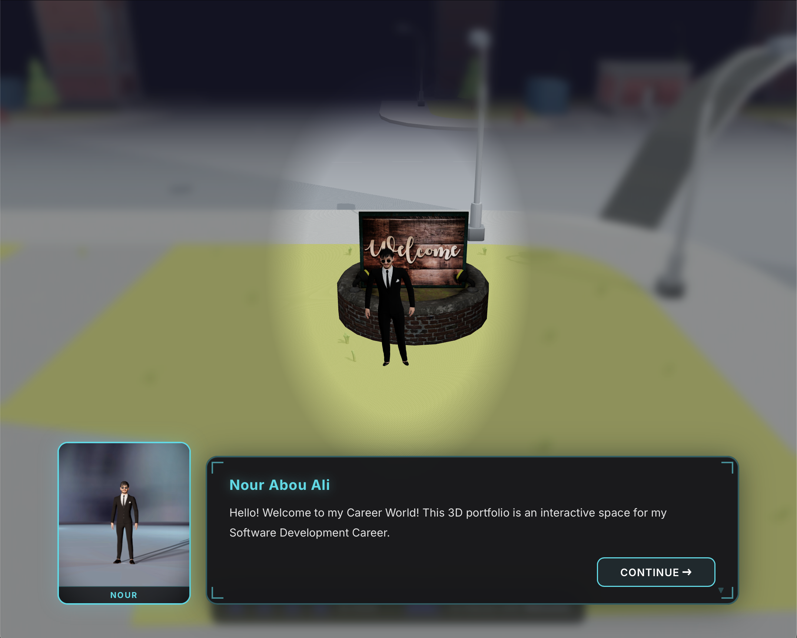

<h1 align="center">Interactive 3D Developer Portfolio</h1>

<p align="center">
  <strong>A modern, WebGL-powered personal portfolio built to showcase full-stack engineering skills through interactive 3D web experiences.</strong>
</p>

<p align="center">
  
</p>

## 🚀 Overview

This project is not just a static site; it is a fully interactive 3D environment built to demonstrate advanced front-end capabilities. It combines React's component-based architecture with Three.js rendering to create an immersive, asset-driven user experience ("Career World").

### ✨ Key Features
- **Interactive 3D Environment:** Built custom WebGL scenes using `@react-three/fiber` and `@react-three/drei`.
- **Fluid UI Animations:** Integrated GSAP for smooth, high-performance scroll and state animations.
- **Optimized Rendering:** Leveraged Vite for lightning-fast HMR during development and heavily optimized asset loading for production.
- **Component-Driven Design:** Scalable React architecture separating the 3D canvas logic from standard UI overlays.

## 🛠️ Tech Stack
- **Framework:** React + Vite
- **3D Rendering:** Three.js, React Three Fiber, React Three Drei
- **Animation:** GSAP (GreenSock)
- **Deployment:** [Insert Vercel, Netlify, or GitHub Pages]

## 💻 Running the Project Locally

To explore the codebase and run the 3D environment on your local machine:

1. **Clone the repository:**
   ```bash
git clone https://github.com/nourabouali/YOUR-REPO-NAME.git
```
2. **Install dependencies:**
   ```bash
npm install
```
3. **Start the development server:**
   ```bash
npm run dev
```

Open the URL shown in the terminal (typically `http://localhost:5173`).

## 📁 Project Structure
- `src/` — main application source code
- `src/components/` — 3D scene components, UI panels, and portfolio cards
- `assets/` — images, 3D models, and other media assets
- `public/` — static files served by Vite

## 🚀 Scripts
- `npm run dev` — start development server
- `npm run build` — create optimized production build
- `npm run preview` — preview production build locally
- `npm run lint` — run ESLint across the project

## 💡 Notes
This portfolio is designed to be an interactive showcase of web and 3D engineering skills. Replace the placeholder demo link and repository URL with your live deployment and repo details.
